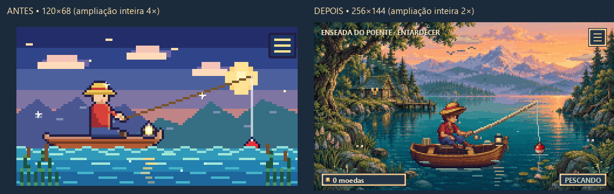

# Pesca Idle — Enseada do Poente

Jogo idle de pesca para Windows, feito em Python com PySide6.

A tabela de capturas reúne peixes e outras espécies aquáticas; os critérios e as fontes usados para ajustar raridade e recompensa estão em [`CRITERIOS_RARIDADE.md`](CRITERIOS_RARIDADE.md).

A opção **Enciclopédia** do menu registra cada espécie. O valor é revelado após 1 captura, a raridade após 5 e a curiosidade após 10.

Na Enciclopédia, escolha ordenar alfabeticamente ou por quantidade pescada. Ela lista apenas espécies já descobertas. A loja também inclui novos cosméticos e acessórios com efeitos visuais próprios.

Os itens da loja aparecem em ordem crescente de preço dentro de cada categoria. Chapéus, roupas, bandeiras, boias, mascotes e acessórios têm várias opções visuais desbloqueáveis.

A arte original usa um lago acolhedor com floresta, cabana, sprites e painéis inspirados no acabamento dos RPGs de SNES. A cena tem 256×144 pixels lógicos, ampliados a 2× com nearest-neighbor, numa janela base de 512×288. Em escalas fracionárias do Windows, a janela ajusta o tamanho para manter ampliação inteira em pixels físicos; a 125%, por exemplo, usa 3×. A janela abre no canto inferior direito, pode ser arrastada e continua sempre no topo. O jogo funciona totalmente offline.

A iluminação acompanha **o relógio local do dispositivo**: amanhecer das 5h às 8h, dia, luz de meio-dia das 11h às 14h, entardecer das 17h às 20h e noite. As cores se interpolam ao longo dessas faixas. Não usa localização, rede ou cálculo astronômico de nascer/pôr do sol. Mudanças de hora ou fuso no dispositivo aparecem na próxima renderização, inclusive após suspensão. Pausar a pesca mantém o relógio visual e os movimentos ambientais.



## Jogar

Gere `dist/PescaIdle.exe` seguindo **Gerar o executável** abaixo. A pasta `dist/` é saída de build e não é commitada; o `PescaIdle.exe` na raiz é a versão anterior.

## Executar pelo código-fonte

Na pasta do projeto, crie o ambiente, instale as dependências e execute:

```powershell
py -3.12 -m venv .venv
.\.venv\Scripts\python.exe -m pip install -r requirements.txt
.\.venv\Scripts\python.exe pesca_idle.py
```

## Gerar o executável

Em um checkout novo, prepare o ambiente com Python 3.12 e as dependências. Para empacotar:

```powershell
py -3.12 -m venv .venv
.\.venv\Scripts\python.exe -m pip install -r requirements-build.txt
.\.venv\Scripts\python.exe -m PyInstaller --noconfirm PescaIdle.spec
```

O executável é gerado em `dist/PescaIdle.exe`.

O spec inclui os PNGs de produção e o manifesto dos cosméticos, sem os masters de arte. Os caminhos são resolvidos pelo diretório do módulo ou por `sys._MEIPASS`, independentemente da pasta de trabalho. Para apenas jogar pelo código, instale `requirements.txt`.

## Arte e manutenção

- `pesca_idle.py`: sistemas de jogo, catálogo e fluxos Qt.
- `pesca_visual.py`: composição, assento, mãos, sprites, animações e cache LRU de até 192 imagens.
- `pesca_ambiente.py`: nuvens, pássaros, meteoros, sombras de peixes e vegetação; máscaras e sprites de vento preparados uma vez.
- `pesca_luz.py`: paletas por material, 96 camadas fixas de iluminação, interpolação pelo horário local e luzes noturnas.
- `pesca_equipamentos.py`: 11 varas com rampas próprias, carretilha, argolas e anzol com isca animada.
- `pesca_ui.py`: molduras, ícones, tipografia e notificações com quebra de linha.
- `assets/*.png`: cenário, primeiro plano, pescador, casco, moldura e ícones finais.
- `assets/cosmeticos.json`: ordem das células dos atlases e os identificadores originais dos itens.
- `assets/source/`: masters originais produzidos pela ferramenta integrada image_gen. [Direção e prompts completos](assets/ART_DIRECTION.md).

Os 17 chapéus, 14 mascotes e 14 boias têm sprites redesenhados em atlases locais, com encaixes próprios para elmos e capuzes. Todos os mascotes respiram, piscam e movimentam orelhas, caudas ou nadadeiras em poses curtas, mantendo os pés apoiados. As roupas mantêm o volume do pescador; as 13 bandeiras têm dobras animadas e acessórios usam efeitos em pixels. Os ícones da loja mostram a arte do item equipado. O casco tem camadas traseira e dianteira, banco e sombras de contato. Textos são renderizados na resolução da interface para preservar acentos e valores; status, inventário e conquistas têm painéis com rolagem. A prévia da loja usa o renderer real a 2×, ou 1× em telas menores. Escolher um item não o compra; a prévia é descartada ao fechar.

O barco oscila com o pescador e seus equipamentos ancorados ao casco; o reflexo fragmentado se desloca abaixo dele. Nuvens passam lentamente, sombras de peixes nadam sob as ondulações e folhas e samambaias balançam nas margens. Durante o dia, bandos de pássaros e borboletas visitam a enseada. No escuro, surgem vaga-lumes, uma coruja sonolenta, estrelas e reflexos da lua; uma estrela cadente passa brevemente após cerca de 8 segundos de animação e a cada 83 segundos, somente com iluminação noturna. Efeitos de acessórios têm movimentos lentos e pequenos brilhos. A isca é um detalhe visual do equipamento existente; não cria consumíveis ou novas regras de pesca.

Movimentos usam uma fase visual independente do relógio civil. Não consomem a aleatoriedade da pesca nem afetam economia ou saves. Cenário e primeiro plano preservam os mesmos grupos de pixels em todos os horários; a noite combina sombras frias e luz quente de cabana e lanterna.

Para preparar novamente os PNGs a partir dos masters e gerar a moldura e os ícones:

```powershell
.\.venv\Scripts\python.exe tools\prepare_art.py
.\.venv\Scripts\python.exe tools\prepare_cosmetics.py
.\.venv\Scripts\python.exe tools\build_ui.py
```

A preparação limita as paletas, elimina dithering e produz transparência binária. Pillow é usado apenas na produção e nos testes; o jogo depende somente de PySide6.

## Saves, testes e imagens

O save continua em `%APPDATA%\PescaIdle\save.json`. Identificadores, inventário, economia, probabilidades, progressão, conquistas e limite de 4 horas offline foram preservados. A fisgada continua durando 1,5 segundo; a animação de captura não altera a espera nem o resultado seguinte.

```powershell
.\.venv\Scripts\python.exe tools\validate_game.py
.\.venv\Scripts\python.exe tools\capture_animation.py
.\.venv\Scripts\python.exe tools\smoke_exe.py
```

Esses comandos usam saves temporários isolados, incluindo a inicialização que salva automaticamente. O teste integrado compara economia e simulação offline à revisão original `b4ef8c7` do Git. O smoke test do executável roda de outra pasta e verifica o carregamento dos assets empacotados.

Para uma sessão manual isolada:

```powershell
$env:PESCA_IDLE_SAVE_PATH = Join-Path $env:TEMP 'PescaIdle-teste\save.json'
.\.venv\Scripts\python.exe pesca_idle.py
Remove-Item Env:PESCA_IDLE_SAVE_PATH
```

[Comparação](docs/visual/comparacao.png), [repouso](docs/visual/depois.png), [fisgada](docs/visual/fisgada.png), [captura](docs/visual/captura.png), [animação](docs/visual/animacao.gif), [dia animado](docs/visual/ambiente.gif), [noite animada](docs/visual/noite-animada.gif), [horários](docs/visual/ciclo-horarios.png), [loja](docs/visual/loja.png), [enciclopédia](docs/visual/enciclopedia.png) e [menu](docs/visual/menu.png). Há galerias dos 91 cosméticos, 11 níveis de barco e vara, e poses dos mascotes em `docs/visual/`.

[Timelapse de 24 horas](docs/visual/ciclo-dia-noite.gif): acelera o relógio **apenas na exportação de QA** para demonstrar as transições. No jogo, o ciclo acompanha o horário real do dispositivo.

[Relatório de validação e limites](docs/VALIDACAO.md).
[Auditoria do objetivo completo](docs/UPGRADE_AUDIT.md).
